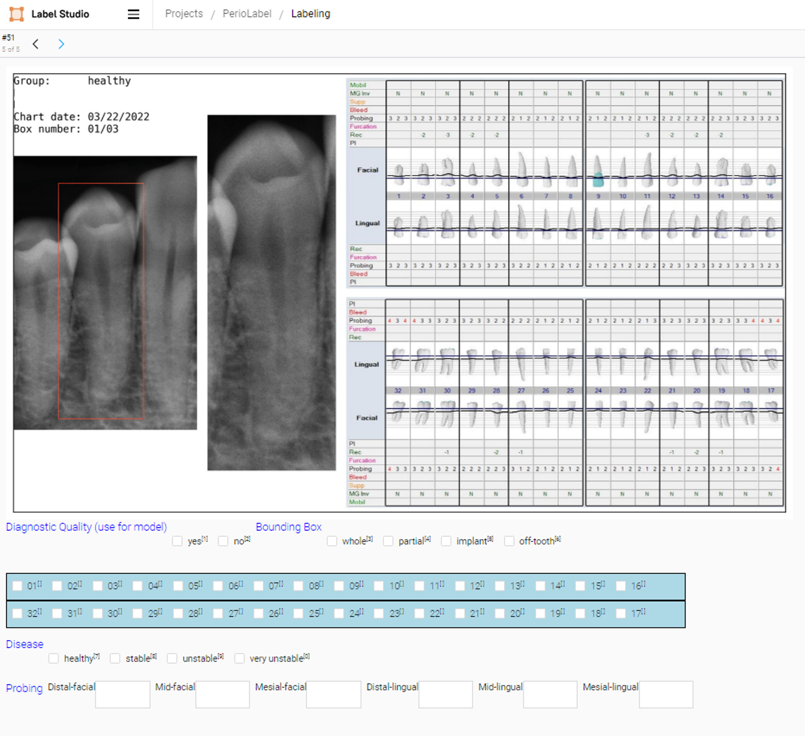

[](
https://pyscaffold.org/)
[](
https://www.python.org/downloads/release/python-3118/)
[](
https://github.com/ccb-hms/periomodel/actions/workflows/pytest.yml)
[](
https://github.com/ccb-hms/periomodel/actions/workflows/docker.yml)

<p float="left">
    
</p>

## Estimating Periodontal Stability Using Computer Vision ## 

This repository contains the code for the periodontal stability model as described in [[1]](#1).
The following notebooks are provided to demonstrate how to use the model 
and to predict the disease classes on the test cases.

- [Download test dataset and model checkpoint](./notebooks/01-download-data.ipynb)
- [Run the model on the test data](./notebooks/02-run-model.ipynb)

The execution of the notebooks require model weights and test data which can
be downloaded. Contact the authors of the manuscript to request access to the data.
## Installation with Docker ##
The most convenient way to get started with this repository is with [Docker](https://docs.docker.com/). 
The included [Dockerfile](Dockerfile) builds a container image with a reproducible Python environment. The docker image is based on 
Debian GNU Linux distribution with Python 3.11.9. All libraries that were 
used to train and evaluate the model are included in the docker image.

Here's a step-by-step guide on how to get started:

1. Install [Docker](https://docs.docker.com/) on your machine.
2. Clone the GitHub project repository to download the contents of the repository:
```bash
# Clone the repository in the local environment
git clone git@github.com:ccb-hms/periomodel.git
```
3. Change into the repository's directory directory.
4. Build the Docker image from the `Dockerfile` using the `docker compose build` command: 
```bash
# Change into the repository's directory
cd periomodel
# Build the docker image
docker compose build
```
5. Edit the last line in the `docker-compose.yml` file to map a local data directory (for example: 
`/user/username/data` to the container at runtime:
```bash
# Edit the last section of the docker-compose.yml file
volumes:
      - .:/app
      - /user/username/data:/app/data
```
6. Use the `docker compose up` command to run the Docker container based on the configurations 
in the `docker-compose.yml` file.
```bash
docker compose up
```
This command also starts a jupyter lab server inside the container which can be accessed
from a browser by clicking on the link displayed.

### GPU support for Docker ###

The container does not require a hardware accelerator (GPU) to run, but the `docker-compose.yml` file can be
modified accordingly to permit access to a GPU driver from inside the container.
For detailed instructions on how to set this up, refer to the [Docker documentation](https://docs.docker.com/compose/gpu-support/). 
To enable GPU access, 
the [NVIDIA Container Toolkit](https://docs.nvidia.com/datacenter/cloud-native/container-toolkit/latest/install-guide.html) 
is needed. The software provides a set of tools designed to enable GPU-accelerated applications to run 
within Docker containers. See the [NVIDIA Container Toolkit](https://docs.nvidia.com/datacenter/cloud-native/container-toolkit/latest/install-guide.html) page for installation instructions.

## Installation without Docker ##

To install the python package into a local environment we provide [Pipfile](Pipfile) and [Pipfile.lock](Pipfile.lock) files 
which produce deterministic builds. These file require [Pipenv](https://pipenv.pypa.io/en/latest/index.html), a convenient
python virtualenv management app that integrates pipenv and virtualenv.
```bash
# Create a pipenv environment with all dependencies
pipenv install -e . 
# Then, install development dependencies [dev-packages]
pipenv install --dev
# Run the jupyter lab server using the docker entry script
pipenv run ./bash_scripts/docker_entry
```
The notebooks use an environment variable called `DATA_ROOT` to provide a  
location for data files. For use with the container, the folder mapping is defined in the `docker-compose.yml` file
under the `volumes` section, as described [above](#Installation with Docker). When using Pipenv as package manager, the `DATA_ROOT` variable is 
defined within the [.env](.env) file and automatically exported into the environment after activation.

## Annotation of dental radiographs ##

[Label Studio](https://labelstud.io/) is an open-source data labeling tool for labeling, annotating, 
and exploring many different data types. Additionally, the tool includes 
a machine learning interface that can be used for new model training, 
active learning, supervised learning, and many other training techniques.

1. Multi-type annotations: Label Studio supports multiple types of annotations, including labeling for audio, 
video, images, text, and time series data. These annotations can be used for tasks such as object detection, 
semantic segmentation, and text classification among others.
2. Customizable: The label interface can be customized using a configuration API.



3. Machine Learning backend: Label Studio allows integration with machine learning models. 
4. Data Import and Export: Label Studio supports various data sources for import and export. 
Data can be imported from Amazon S3, Google Cloud Storage, or a local file system. Export formats include 
popular formats like COCO, Pascal VOC, or YOLO.
5. Collaboration: The program supports multiple users, making it suitable for collaborative projects.
6. Scalability: Label Studio can be deployed in any environment, be it on a local machine or in a distributed setting, 
making it a scalable solution.

### How to Use Label Studio ###
The labeling software is included here as a [submodule](https://git-scm.com/book/en/v2/Git-Tools-Submodules).
Please refer to the original [Label Studio repository](https://github.com/HumanSignal/label-studio) for installation instructions.

---
## References
<a id="1">[1]</a> 
Feher B, Werdich AA, Chen CY, Barrow J, Lee SJ, Palmer N, Feres M  
*Estimating Periodontal Stability Using Computer Vision*
